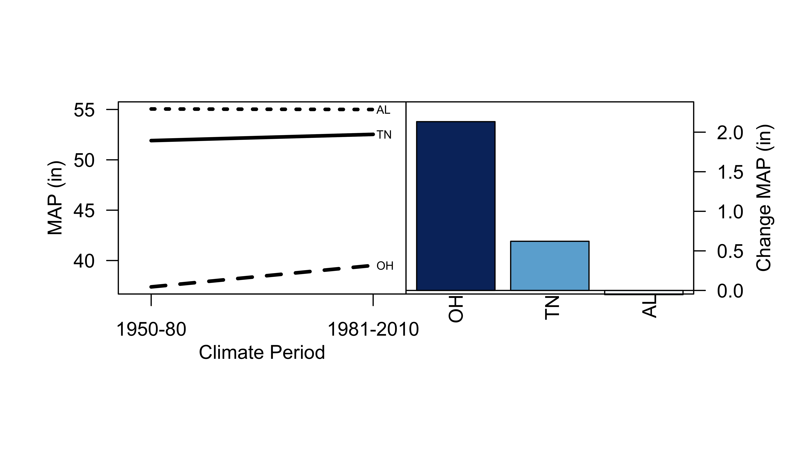

<!--Search:
LYP.COMMENT: for my modularity comments
-->

```{r setup, include=FALSE}
knitr::opts_chunk$set(echo = TRUE)
```

<!--This chunk will:
1. load my pacakges
2. upload my data
3. clean my data (subest to timeframe, remove NA and <40YR data)

All other chunks are dependant on this chunk
-->
```{r pckgs uplddtfrm clndt, echo=FALSE, eval=TRUE, message=FALSE, include=FALSE}
#packages---------
#***********************************************
library(colorRamps)
library(dplyr)
library(RColorBrewer)
#LYP.COMMENT: Modularity lesson 10, use packages for commonly used functions

#upload dataframes---------
#***********************************************

precip<-readRDS("USAAnnualPcpn1950_2016.rds")
temp<-readRDS("USAAnnualTemp1950_2016.rds")
ClmtRgns<-read.csv("ClimateRegionsUSA.csv")

MaxYear<-2010

subsetyears<-function(df){
df$Year.cut<-cut(df$year, c((min(df$year)-1),MaxYear,(max(df$year))+1), labels=c(0,1))
df<-subset(df,Year.cut==0)
return(df)
}

temp<-subsetyears(temp)
precip<-subsetyears(precip)
names(temp)#data is now called variable, I need to fix it

names(temp)[3]<-paste("data") 

#Clean data--------
#***********************************************

#Function to clean temperature and precipitation data:
#Step 1: remove NA from the dataframe
#Step 2: remove weather stations with less than two years data
#return: a cleaned weather matrix
#Step 3: subset the data to the correct timeframe 1950-2010

WthrStnClean<-function(df){
  df<-na.exclude(df)
  df["latlon"]<-paste(df$lat,df$lon)
  df$latlon<-as.factor(df$latlon)
  df["Count"]<-paste(1)
  df$Count<-as.numeric(df$Count)
  Countdf<-aggregate(df$Count,by=list(df$latlon),sum)

  Countdf["Include"]<-NA
  TimePeriod<-40

  for(i in 1:NROW(Countdf)){
    Countdf$Include[i]<-if(Countdf$x[i]<TimePeriod){0}else{1}
  }

  names(Countdf)[1]<-paste("latlon") 
  names(Countdf)[2]<-paste("NoYearData") 
  df<-left_join(df,Countdf,by="latlon")
  df<-subset(df,Include==1)
  }

temp<-WthrStnClean(temp)
precip<-WthrStnClean(precip)


```

##**Introduction**
Altering the balance of greenhouse gases in Earth's atmosphere has elevated temperatures and altered precipitation regimes across the globe; yet at regional scales climate change can have positive, negative, and even no effect on both.  Elevated atmospheric concentrations of carbon dioxide, CO~2~, are largely implicated in global climate changes over the last century.  Independent of mechanism, determining the direction of temperature and precipitation changes on a regional scale is crucial for mitigating the effects of climate change.  We ask if the temperature and precipitation in N. America, specifically in the United States, has increased since the mid-1900s?  We hope our work will shed light on continental scale changes in climate over the last half a century.   

##**Methods**
Temperature and precipitation data were downloaded from the Applied Climate Information System. Weather stations with less than 40 years worth of available data were removed to ensure short-term, year-to-year fluctuations did not bias our analysis.  We evaluated whether climate changed by comparing mean temperature and precipitation over ~30 year time periods.  We defined baseline conditions as 1950-1980 (Smith and Pitts 1997) and 1981-2010 as the climate change period for comparison.  We further defined climate regions to explore the interaction between climate and region in the United States.  We classified temperature into regional means using nine groups in the contiguous United States (Karl and Koss 1984); Alaska and Hawaii were grouped into their own climate regions totaling 11.  We only had precipitation data from three states, Ohio, Tennessee, and Alabama; rather than using regions, we grouped by state to evaluate the interaction between climate and small-scale changes in precipitation.   


**Figure 1:**  Map of US climate regions used to classify states. Image curtosy of the National Oceanic and Atmospheric Administration website: <https://www.ncdc.noaa.gov/monitoring-references/maps/us-climate-regions.php>

##**Results**
<!--LYP.COMMENT: Modularity lesson 4, define modules precisely in advanced

This chunk will:
create the function to calculate:
1. mean annual weather [aggregate]
2. create time frame categoies

OBJ 2, and OBJ 3 are dependant on this chunk
-->
```{r code OBJ 1, echo=FALSE, eval=TRUE, message=FALSE, include=FALSE}
#Objective 1---------
#***********************************************


MAweather<-function(df){
  MAT<-aggregate(df$data,by=list(df$year), mean)
  names(MAT)[2]<-paste("data") 
  names(MAT)[1]<-paste("year") 
  MAT$ClimPrd<-cut(MAT$year, c((min(MAT$year)-1),1980,(max(MAT$year))+1), labels=c(0,1))
  return(MAT)
}

MAT.temp<-MAweather(temp)

```

<!--create the function to calculate:
#Step 1: calculate mean annual tempearture by climate ragion[aggregate]
#Step 2: calculate the change in mean annual temp by region

OBJ 3 is dependant on this chunk
#LYP.COMMENT: Modularity lesson 8, be aware of dependancies
-->
```{r code OBJ 2, echo=FALSE, eval=TRUE, message=FALSE, include=FALSE}
MAweather.RGN<-function(df){
  df<-left_join(df,ClmtRgns,by="state")
  df$ClimPrd<-cut(df$year, c((min(df$year)-1),1980,(max(df$year))+1), labels=c(0,1))
  MAT.rgnprd<-aggregate(df$data,by=list(df$ClimPrd,df$region), mean)
  names(MAT.rgnprd)[3]<-paste("data") 
  names(MAT.rgnprd)[1]<-paste("ClimPrd") 
  names(MAT.rgnprd)[2]<-paste("region")
  return(MAT.rgnprd)
}

MAweather.RGNdiff<-function(df){
  MAT.diff.rgnprd<-aggregate(df$data,by=list(df$region),diff)
  names(MAT.diff.rgnprd)[1]<-paste("region") 
  names(MAT.diff.rgnprd)[2]<-paste("changetemp")
  MAT.diff.rgnprd<-MAT.diff.rgnprd[rev(order(MAT.diff.rgnprd$changetemp)),]
  return(MAT.diff.rgnprd)
}

MAT.rgnprd<-MAweather.RGN(temp)
MAT.diff.rgnprd<-MAweather.RGNdiff(MAT.rgnprd)

```
Mean annual temperature increased `r round(mean(MAT.temp$data[which(MAT.temp$ClimPrd==1)]-mean(MAT.temp$data[which(MAT.temp$ClimPrd==0)])),2)` F from 1950-1980 to 1981-2010.  With increased temperatures we also observed a flattening of the density function, indicating more time spent at a wider range of temperatures than under baseline climate conditions (Fig. 2).  In all US climate regions mean annual temperature increased in 1981-2010.  We observed the largest change in mean annual temperature in Alaska, the NW central (northern Rockies and plains), and the NE central(upper midwest) regions.  We observed the smallest increases in mean annual temperature in the southeast, hawaii, southwest, and southern regions (Fig. 3).  

<!--This chunk:
repeats chunk from OBJ1 and OBJ2 for precipitaiton,
-->
```{r code OBJ 3, echo=FALSE, eval=TRUE, message=FALSE, include=FALSE}
#Objective 3---------
#***********************************************
#LYP.COMMENT: Modularity lesson 7, write pseudocode

#Can we see precipitation changes for ourselves by analyzing these data?
#Step 1: calculate mean annual precipitation [aggregate]
#Step 2: create a time period category [1950-1980, 1981-2010]
#Step 3: boxplot and density functions of MAP by climate period 

MAP<-MAweather(precip)

MAweather.ST<-function(df){
  df<-left_join(df,ClmtRgns,by="state")
  df$ClimPrd<-cut(df$year, c((min(df$year)-1),1980,(max(df$year))+1), labels=c(0,1))
  MAT.rgnprd<-aggregate(df$data,by=list(df$ClimPrd,df$state), mean)
  names(MAT.rgnprd)[3]<-paste("data") 
  names(MAT.rgnprd)[1]<-paste("ClimPrd") 
  names(MAT.rgnprd)[2]<-paste("region")
  return(MAT.rgnprd)
}

MAP.rgnprd<-MAweather.ST(precip)
MAP.diff.rgnprd<-MAweather.RGNdiff(MAP.rgnprd)

```

Mean annual precipitation increased `r round(mean(MAP$data[which(MAP$ClimPrd==1)]-mean(MAP$data[which(MAP$ClimPrd==0)])),2)` inches from 1950-1980 to 1981-2010 (Fig. 4).  We observed the largest change in mean annual precipitation in Ohio and the slight decrease in mean annual precipitation in Alabama (Fig. 5).  

```{r plot1, echo=FALSE, eval=TRUE, message=FALSE, include=FALSE}
#Ploting mean weather:
#step 1: creating boxplot
#step 2: density plot

#LYP.COMMENT: Modularity lesson 1: do not type constants into your code

#setting the many plot parameters
Xaxislab.plota<-"Climate Period"
Xaxiscat.plota<-c("1950-80","1981-2010")
Yaxislab.plota<-"MAT (F)"
Xaxislab.plotb<-"MAT (F)"
Yaxislab.plotb<-"Density"
ClmtPrd1color<-"grey27"
ClmtPrd2color<-heat.colors(1)
plotname<-"Objective1.png"
plotcolors<-c(ClmtPrd1color,ClmtPrd2color)


ClmtPrd1<-c(MAT.temp$data[which(MAT.temp$ClimPrd==0)])
ClmtPrd2<-c(MAT.temp$data[which(MAT.temp$ClimPrd==1)])

plotfnct<-function(df){
  #Creating the density functions
  d1950<-density(df$data[which(df$ClimPrd==0)])
  y1950<-approxfun(d1950$x, d1950$y)
  ymax1950<-y1950(mean(df$data[which(df$ClimPrd==0)]))
  d1981<-density(df$data[which(df$ClimPrd==1)])
  y1981<-approxfun(d1981$x, d1981$y)
  ymax1981<-y1981(mean(df$data[which(df$ClimPrd==1)]))
  ylimvector<-c(ymax1950,ymax1981)
  ymaxdensity<-(max(ylimvector)+(0.15*max(ylimvector)))
  densityylim<-c(0,ymaxdensity)

  #Plotting
  png(plotname, width = 7, height = 4, units = 'in', res = 800)
  layout(matrix(1:2, ncol = 2), widths = 1, heights = 1, respect = FALSE)
  par(mar = c(4.3, 2.1, 1.4, 0), oma=c(3,3,3,3))
  boxplot(data~ClimPrd, data=df, col=plotcolors, las=1
          ,xlab=Xaxislab.plota, xaxt="n", ylab="", yaxt="n")
  axis(1,c(1,2),Xaxiscat.plota)
  axis(2, las=1)
  mtext(side=2,Yaxislab.plota, line=2.85)
  par(mar = c(4.3, 0, 1.4, 2.1))
  plot(density(ClmtPrd1)
       ,xlim=c(min(df$data),max(df$data))
       ,ylim=densityylim
       ,las=1,xlab=Xaxislab.plotb, ylab="",yaxt="n"
       ,main="",lty=3,lwd=2,col=ClmtPrd1color)
  segments(mean(ClmtPrd1),0, mean(ClmtPrd1), 
           ymax1950,lwd=2,lty=3,col=ClmtPrd1color)
  lines(density(ClmtPrd2), col=ClmtPrd2color, 
        xlim=c(min(df$data),max(df$data)), lwd=2)
  segments(mean(ClmtPrd2),0,mean(ClmtPrd2), 
           ymax1981,lwd=2,col=ClmtPrd2color)
  axis(side=4,las=1)
  mtext(side=4,Yaxislab.plotb,line=2.75)
  dev.off()
}

plotfnct(MAT.temp)
```

**Figure 2:** Mean annual temperature (F), MAT, across the United States of America (including Hawaii and Alaska) increased from baseline conditions, 1950-1980.  A boxplot of the means (leftpanel) and density function describe the mean, range, and frequency of temperatures observed (rightpanel).
```{r plot2, echo=FALSE, eval=TRUE, message=FALSE, include=FALSE}
#Ploting mean weather by region/state:
#step 1: creating interaction plot
#step 2: plotting change in weather (barplot, highest-lowest)

ClmtPrd0<-(MAT.rgnprd$data[which(MAT.rgnprd$ClimPrd==0)])
ClmtPrd1<-(MAT.rgnprd$data[which(MAT.rgnprd$ClimPrd==1)])
ClmtPrd1labels<-(MAT.rgnprd$region[which(MAT.rgnprd$ClimPrd==1)])
clmtPrddf<-data.frame(ClmtPrd1, ClmtPrd1labels)
clmtPrddf<-clmtPrddf[rev(order(clmtPrddf$ClmtPrd1)),]
clmtPrddf["clmtPrddfabv"]<-c("HI","SE","S","W","C","SW","NW","NE","NEC","NWC","AK")
leftside<-c("","","S","","" ,"SW","","NE","","NWC","")
rightside<-c("HI","SE","","W","C","", "NW","","NEC","","AK")  
lablocations<-clmtPrddf$ClmtPrd1

NumRegions<-NROW(unique(ClmtRgns$region))
RegionColors<-heat.colors(NumRegions)
Rlabelsinteractionplot<-2.015
Llabelsinteractionplot<-0.985

PlotAyaxislabel<-"MAT (F)"
PlotAxaxislabel<-"Climate Period"
PlotAxaxis<-c("1950-80","1981-2010")

barplotvector<-MAT.diff.rgnprd$changetemp
barplotlabels<-MAT.diff.rgnprd$region
PlotBYaxislim<-c(0,max(MAT.diff.rgnprd$changetemp)+0.25)
xlab.barplot<-c(0.7,1.93,3.17,4.33,5.48,6.8,7.88,9.11,10.34,11.58,12.81)
PlotBaxislabel<-"Change MAT (F)"
plotname2<-"Objective2.png"

#plots
plotfnct2<-function(df){
  png(plotname2, width = 7, height = 4, units = 'in', res = 800)
  layout(matrix(1:2, ncol = 2), widths = 1, heights = 1, respect = FALSE)
  par(mar = c(4.3, 2.1, 1.4, 0), oma=c(3,3,3,3))
  with(df,interaction.plot(ClimPrd,region,data, lwd=3, las=1, ylab="",xlab="", xaxt="n", legend=F, yaxt="n"))
  text(Rlabelsinteractionplot,lablocations,rightside, adj=0, cex=0.6)
  text(Llabelsinteractionplot,lablocations,leftside, adj=1, cex=0.6)
  axis(side=2, las=1)
  mtext(PlotAyaxislabel, side=2, line=2.25)
  mtext(PlotAxaxislabel, side=1, line=2)
  xvalclmtprd0<-rep(1,NROW(ClmtPrd0))
  xvalclmtprd1<-rep(2,NROW(ClmtPrd1))
  axis(1,c(1,2),PlotAxaxis)
  par(mar = c(4.3, 0, 1.4, 2.1))
  barplot(barplotvector, col=RegionColors, las=1, 
          ylim=PlotBYaxislim,
          yaxt="n")
  abline(h=0)
  text(cex=1, x=xlab.barplot, y=-0.05, barplotlabels, xpd=TRUE, srt=90, adj=1)
  mtext(side=4,PlotBaxislabel, line=2.5)
  axis(side=4, las=1)
  box()
  dev.off()
}

plotfnct2(MAT.rgnprd)

```

**Figure 3:** Mean annual temperature (F), MAT, increased in 11 climate regions from baseline conditions, 1950-1980.  The interaction between climate period and region (leftpanel) shows temperatures increased in all 11 regions, while the change in MAT (rightpanel) describes the magnitude of the change in each region.

```{r plots 3 4, echo=FALSE, eval=TRUE, message=FALSE, include=FALSE}
#Change all of the variables and run functions used to make figure 2 & 3

Xaxislab.plota<-"Climate Period"
Xaxiscat.plota<-c("1950-80","1981-2010")
Yaxislab.plota<-"MAP (in)"
Xaxislab.plotb<-"MAP (in)"
Yaxislab.plotb<-"Density"
ClmtPrd1color<-"grey27"
MatchColors<-rev(colorRampPalette(brewer.pal(9,'Blues'))(3))
ClmtPrd2color<-MatchColors[1]
plotname<-"Objective3.png"
plotcolors<-c(ClmtPrd1color,ClmtPrd2color)

ClmtPrd1<-c(MAP$data[which(MAP$ClimPrd==0)])
ClmtPrd2<-c(MAP$data[which(MAP$ClimPrd==1)])

plotfnct(MAP)

ClmtPrd0<-(MAP.rgnprd$data[which(MAP.rgnprd$ClimPrd==0)])
ClmtPrd1<-(MAP.rgnprd$data[which(MAP.rgnprd$ClimPrd==1)])
ClmtPrd1labels<-(MAP.rgnprd$region[which(MAP.rgnprd$ClimPrd==1)])
clmtPrddf<-data.frame(ClmtPrd1, ClmtPrd1labels)
clmtPrddf<-clmtPrddf[rev(order(clmtPrddf$ClmtPrd1)),]
rightside<-c("AL","TN","OH")
leftside<-c("","","")
lablocations<-clmtPrddf$ClmtPrd1

NumRegions<-NROW(unique(ClmtRgns$region))
RegionColors<-rev(colorRampPalette(brewer.pal(9,'Blues'))(3))
Rlabelsinteractionplot<-2.015

PlotAyaxislabel<-"MAP (in)"
PlotAxaxislabel<-"Climate Period"
PlotAxaxis<-c("1950-80","1981-2010")

barplotvector<-MAP.diff.rgnprd$changetemp
barplotlabels<-MAP.diff.rgnprd$region
PlotBYaxislim<-c((min(MAP.diff.rgnprd$changetemp)-(min(MAP.diff.rgnprd$changetemp)*0.15)),max(MAP.diff.rgnprd$changetemp)+0.25)
xlab.barplot<-c(0.7,1.93,3.17)
PlotBaxislabel<-"Change MAP (in)"
plotname2<-"Objective3b.png"

plotfnct2(MAP.rgnprd)

```

**Figure 4:** Mean annual precipitation (in), MAP, in three states increased from baseline conditions, 1950-1980.  A boxplot of the means (leftpanel) and density function describe the mean, range, and frequency of temperatures observed (rightpanel).


**Figure 5:** Mean annual precipitation (in), MAP, increased in OH and TN, while it decreased slightly in AL, from baseline conditions, 1950-1980.  The interaction between climate period and state (leftpanel) shows precipitation increased in most states, while the change in MAP (rightpanel) describes the magnitude of the change in each state.

##**Discussion**

We observed evidence of climate warming across the eleven regions of the United States between 1950-2010.  We observed the largest magnitude of change in regions with higher latitudes, specifically in Alaska and the northern middle of the continental US.  Though the northwest and northeast are approximately the same latitude, they did not experience the same magnitude of warming; perhaps because both regions are buffered by oceans on either side.  We observed the smallest increases in temperature closer to the equator, in the southern regions across the continental US and in Hawaii.  Changes in precipitation increased overall, but varied in the three states selected.  It is more difficult to predict how changing temperature will effect precipitation, as landscape features, such as mountains, lakes, and oceans, play an equally important role in precipitation.  Our work adds to the growing consensus that climate warming is altering surface temperature and precipitation patterns in the United States.   

###**Literature Cited:**

Smith, J.B. and G.J. Pitts. 1997. Regional climate change scenarios for vulnerability and
adaptation assessments. Climatic Change 36, 3-21.

Thomas R. Karl and Walter James Koss, 1984: "Regional and National Monthly, Seasonal, and Annual Temperature Weighted by Area, 1895-1983." Historical Climatology Series 4-3, National Climatic Data Center, Asheville, NC, 38 pp.